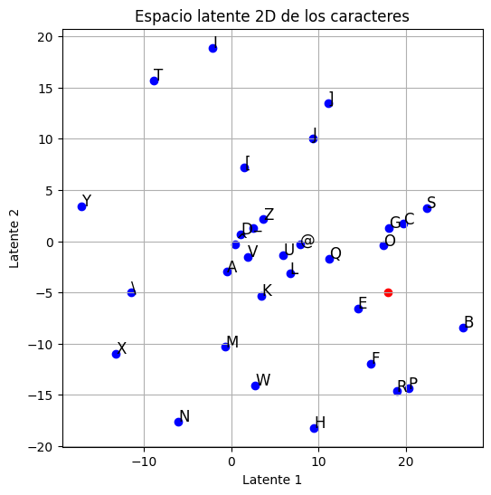
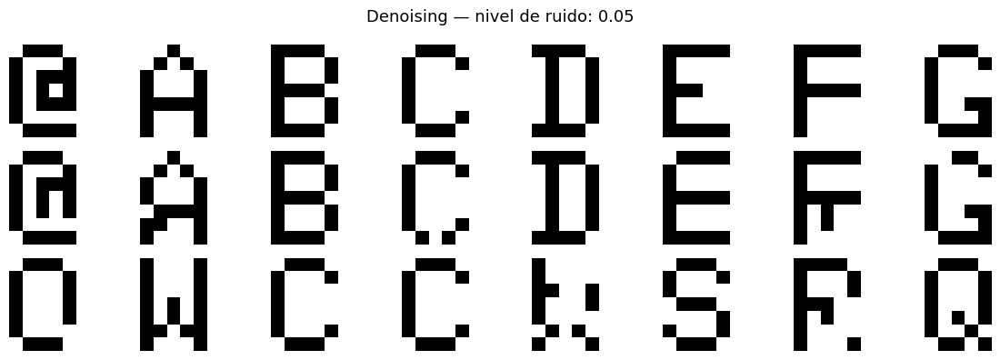
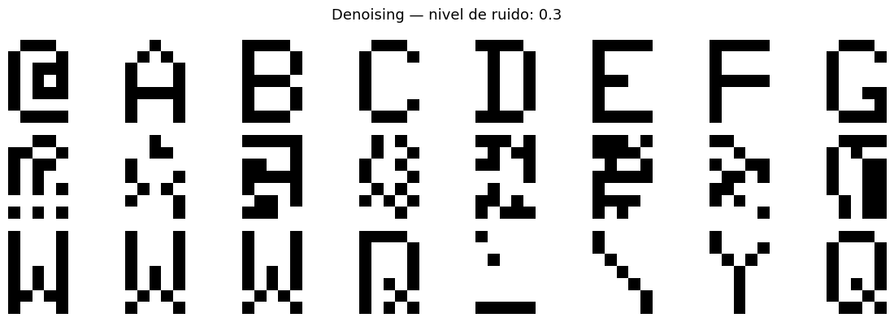

# Autoencoder de caracteres

[English](README.md) · **Español**

Un autoencoder construido con TensorFlow/Keras que comprime caracteres de 7×5 píxeles en un **espacio latente de 2 dimensiones** y los reconstruye. Incluye una variante que elimina ruido aleatorio de caracteres dañados (denoising).

## Contenido

1. **Dataset** — 32 caracteres (A–Z más símbolos) codificados como mapas de bits de 7×5 en hexadecimal, generados dentro del mismo notebook.
2. **Autoencoder** — un encoder denso que comprime cada carácter a 2 valores, y un decoder que reconstruye los 35 píxeles. Entrenado durante 200 épocas.
3. **Visualización del espacio latente** — cada carácter ubicado según sus coordenadas 2D.
4. **Generación** — decodificación de un punto arbitrario del espacio latente para producir un carácter nuevo.
5. **Denoising autoencoder** — misma arquitectura, entrenada con entradas con ruido y salidas limpias.

## Resultados

**Reconstrucción:** la pérdida baja de forma sostenida de ~0.65 a ~0.21, y los caracteres visualmente parecidos quedan cerca entre sí en el espacio latente.

**Eliminación de ruido:** funciona bien con poco ruido y falla con mucho ruido.

| 5% de ruido | 30% de ruido |
|---|---|
|  |  |

*Filas: original · entrada con ruido · reconstrucción.*

Con 30% de ruido (unos 11 de 35 píxeles invertidos) la estructura del carácter cambia demasiado y el modelo devuelve otro carácter. Con solo 32 muestras de entrenamiento, la red memoriza el dataset en lugar de aprender una noción general de "forma".

## Cómo correrlo

Abrir el notebook en **Google Colab** o Jupyter y ejecutar todas las celdas. No se necesitan archivos externos.

## Tecnologías

Python · TensorFlow · Keras · NumPy · Matplotlib
